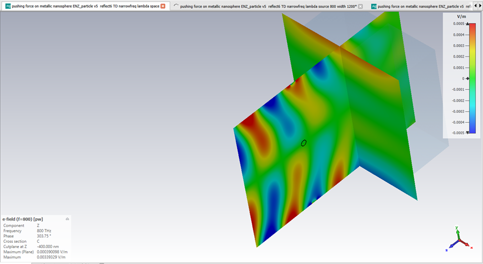
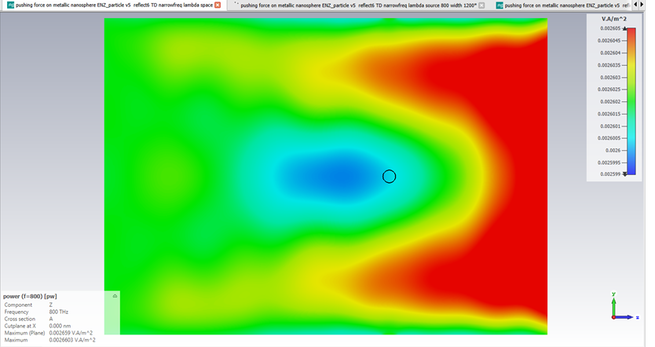
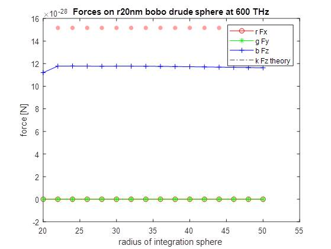

  
# Rotating nanoparticles with optical forces – nanotechnology with a twist

[About the project](./README.md)

[O projektu (HR)](./hrabout.md)

[Activity on the project](./activity.md)

[Contact](./contact.md)

# Activity on the project

## results of the project
<!-- summary 
With this project we (learned and) demonstrated the use of Maxwell's Stress Tensor in order to calculate induced optical forces and torques on small nanoparticles having different shapes. Special emphasis was on nanoparticles excited (by a plane wave) at their zero permittivity frequency to use the analogy between the asociated electromagnetic equation and fluid flow.
...
In particular the following achievements were met:
- Performed analytical work in order to understand the theory behind the extraction of forces and torques from the electromagnetic field spatial profiles, using Maxwell stress tensor and derived quantities for the torque, including analytical work to reframe the well-known three-dimensional case into a two-dimensional case.
- Implementation of the resulting equations into a Matlab software for the retrieval of the force and torque on 3-dimensional and 2-dimensional particles under plane wave illumination, from the electromagnetic fields calculated in a commercial numerical simulation software.
- The calculation method and main idea of the project was presented at iPlasmaNano 2019 conference (15th till 20th September) via poster titled ‘Rotating nanoparticles with optical forces–nanotechnology with a twist’.
- Carried out extensive analytical work on optical forces in order to benchmark the scientific correctness of the developed codes, by comparing simulation results to known forces acting on spherical/cylindrical nanoparticles of dielectric or metallic materials, or on flat reflecting walls.
- Carried out numerical simulations of Epsilon-Near-Zero and other nanoparticles of different shapes, illuminated by incident light at different angles, to plot the force and torque of different particles and situations, as well as the orientation-dependent potential energy of the particle derived from the torque.
The project had a satisfactory outcome. The software to extract force and torque in 2D nanoparticles was successfully used to reproduce known results, and was then used to predict torques and forces acting on differently shaped ENZ nanoparticles.-->

## project log:

### June

#### 3rd of June
I've come to London to start the project!

#### 13th of June
First simulations look ok. The electric field **E** (and associated displacement field **D**) flowing around an subwavelength ENZ slab look like the flow of water aroung an object (ENZ slab is at 45 degrees).

#### 20th of June
I gave a presentation about the work at [Laboratory for optics and optical thin films](https://www.irb.hr/eng/Divisions/Division-of-Materials-Physics/Laboratory-for-optics-and-optical-thin-films) on 'Electric field assisted dissolution of metals' in the project [REPTOSNANODOPS](https://sites.google.com/view/reptosnanodops)

#### 28th of June
First (wrong) results in the calculations of the force from Maxwell's stress tensor due to the simulation space being too small.  
  
Total force (Fx-red, Fy-green, Fz-blue) [N] vs. sidelength [nm] of the cube on whose surfaces the MST and force is calculated. With bigger cubes the force should converge in value, while at small sizes there should be numerical artifacts.

### July
Spent most of the time on investigating (why are there) wrong results. Played around with the mesh of the system, as well as the simulation volume. Observed that the mesh (FD simulations) doesn't play that big of a role (assuming it is decent) and that there is some inherent error with simulations of just the empty space (second graph). Here the analytical result for a sphere is shown in dotted line while different lines represent different meshes and volumes, while the x-axis shows different integration volume sizes for the MST calculations.

So we did calculations for scattered fields (i.e. made 2 simulations with the same mesh with and without the object and substracted the fields), to remove the influance of the excitation and finally got some good results, although the integration volume (x-axis shows the radius of the integration sphere, while y-axis is the force in z direction) for the force needs to be big:

After that we added the plane wave in Matlab (matched to be the same phase and amplitude as the one for excitation). This was to account for the (very small) unwanted component of electric field in the propagation direction and a poyting vector that was not uniform for the simulation of empty space. Another way to combat this is to have the simulation volumes extremely large. 

Unwanted (but small) electric field and poyting vector (shown on the upper graphs) contributed to the decreasing values of the calculated forces at the large sizes of the integration volume due to un-uniform electromagnetic fields.

### August
<!-- *continue checking missmatch and source of difference -->
Switched to TD (FDTD) simulations in order to have better control between simulated mesh and the meshpoints that were exported from CST (there is a limitation of only exporting in hexahedral mesh :/ ). And the results are becoming better due to better understanding of the steps involved:

There is a small missmatch between the theoretical/analytical solution for a sphere and the numerically calculated one that remained (although the mesh was good and the unwanted components of the fields were accounted for).

### September
The main idea of this project, as well as the methodology used, were presented on the [iPlasmaNano 2019 conferance](http://www.iplasmanano2019.com/) in the form of a poster. 

Additionaly, the missmatch and the source of the differance between the expected (analytical) result and numerically obtained (for a simple geometry like a sphere) was further investigated.
This small missmatch was interesting to investigate since it was unexpected and we used a sphere as calibration for our method (since for the more complex shapes there is no analytical solution and would be difficult to compare calculated values with theoretical ones). Although the calculations of forces did have a small missmatch we don't expect it to make problems for the torque calculations since we could make calucateions for torque on an object (since plane waves carry no rotational momentum!) by using the scattered fields. But by investigating the source of the missmatch we have a better confidance in our results. 

### October
<!-- *torque, tensor algebra -->

### November
<!-- *2D -->

### December
<!-- results of the project-->

