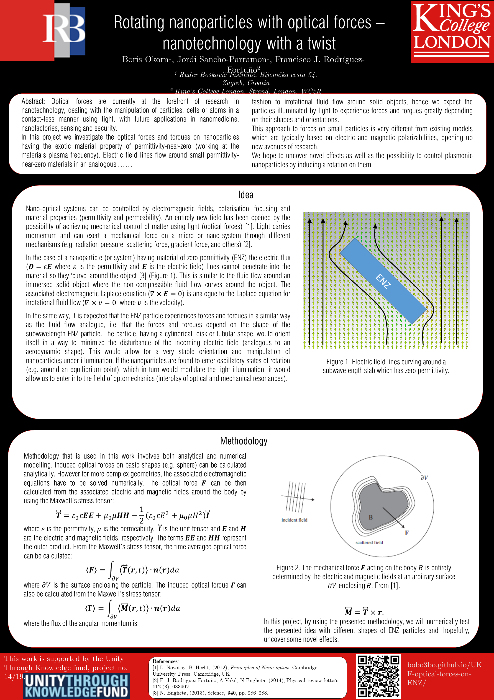
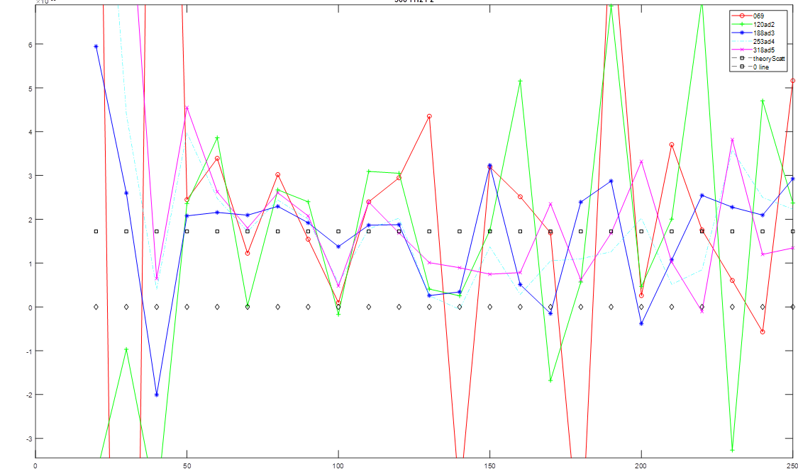
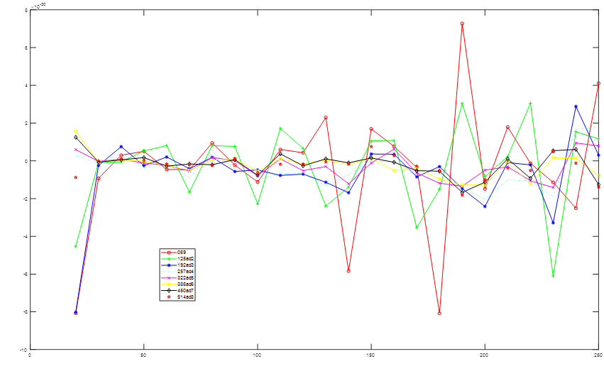
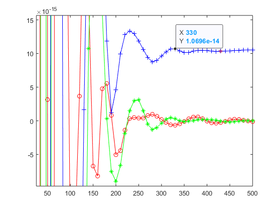

  
# Rotating nanoparticles with optical forces – nanotechnology with a twist

[About the project](./README.md)

[O projektu (HR)](./hrabout.md)

[Activity on the project](./activity.md)

[Contact](./contact.md)

# Activity on the project

## results of the project
<!-- summary 
With this project we (learned and) demonstrated the use of Maxwell's Stress Tensor in order to calculate induced optical forces and torques on small nanoparticles having different shapes. Special emphasis was on nanoparticles excited (by a plane wave) at their zero permittivity frequency to use the analogy between the asociated electromagnetic equation and fluid flow.
...
In particular the following achievements were met:
- Performed analytical work in order to understand the theory behind the extraction of forces and torques from the electromagnetic field spatial profiles, using Maxwell stress tensor and derived quantities for the torque, including analytical work to reframe the well-known three-dimensional case into a two-dimensional case.
- Implementation of the resulting equations into a Matlab software for the retrieval of the force and torque on 3-dimensional and 2-dimensional particles under plane wave illumination, from the electromagnetic fields calculated in a commercial numerical simulation software.
- The calculation method and main idea of the project was presented at iPlasmaNano 2019 conference (15th till 20th September) via poster titled ‘Rotating nanoparticles with optical forces–nanotechnology with a twist’.
- Carried out extensive analytical work on optical forces in order to benchmark the scientific correctness of the developed codes, by comparing simulation results to known forces acting on spherical/cylindrical nanoparticles of dielectric or metallic materials, or on flat reflecting walls.
- Carried out numerical simulations of Epsilon-Near-Zero and other nanoparticles of different shapes, illuminated by incident light at different angles, to plot the force and torque of different particles and situations, as well as the orientation-dependent potential energy of the particle derived from the torque.
The project had a satisfactory outcome. The software to extract force and torque in 2D nanoparticles was successfully used to reproduce known results, and was then used to predict torques and forces acting on differently shaped ENZ nanoparticles.-->

## project log:

### December
<!-- results of the project-->

### November
<!-- *2D -->

### October
<!-- *torque, tensor algebra -->

### September
<!-- *continue checking missmatch and source of difference -->

The main idea of this project, as well as the methodology used, were presented on the [iPlasmaNano 2019 conferance](http://www.iplasmanano2019.com/) in the form of a poster. 

### August
<!-- *continue checking missmatch and source of difference -->

### July
<!-- *problems with calculations, used scatt fields, checked empty space (meshing, simulation volume, diff freq). Checking unwanted Ez component in PW, addPW in Matlab, checking mesh
missmatch theory and numerical -->
Spent most of the time on investigating (why are there) wrong results. Played around with the mesh of the system, as well as the simulation volume. Observed that the mesh (FD simulations) doesn't play that big of a role and that there is some inherent error with simulations of just the empty space (second graph). Here the analytical result for a sphere is shown in dotted line while different lines represent different meshes and volumes, while the x-axis shows different integration volume sizes for the MST calculations.

So we did calculations for scattered fields, to remove the influance of the excitation and finally got some good results, although the integration volume (x-axis shows the radius of the integration sphere, while y-axis is the force in z direction) for the force needs to be big:

<!-- Next step was to take the 
scatt fields and add PW in Matlab-->

### 28th of June
First (wrong) results in the calculations of the force from Maxwell's stress tensor due to the simulation space being too small.  
  
Total force (Fx-red, Fy-green, Fz-blue) [N] vs. sidelength [nm] of the cube on whose surfaces the MST and force is calculated. With bigger cubes the force should converge in value, while at small sizes there should be numerical artifacts.

### 20th of June
I gave a presentation about the work at [Laboratory for optics and optical thin films](https://www.irb.hr/eng/Divisions/Division-of-Materials-Physics/Laboratory-for-optics-and-optical-thin-films) on 'Electric field assisted dissolution of metals' in the project [REPTOSNANODOPS](https://sites.google.com/view/reptosnanodops)

### 13th of June
First simulations look ok. The electric field **E** (and associated displacement field **D**) flowing around an subwavelength ENZ slab look like the flow of water aroung an object (ENZ slab is at 45 degrees).

### 3rd of June
I've come to London to start the project!
