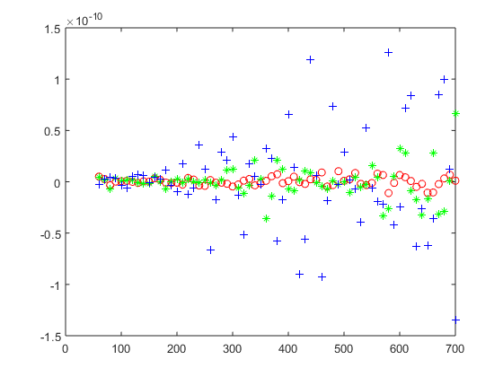

  
# Rotating nanoparticles with optical forces – nanotechnology with a twist

[About the project](./README.md)

[O projektu (HR)](./hrabout.md)

[Activity on the project](./activity.md)

[Contact](./contact.md)

# Activity on the project

## results of the project

A method to numerically calculate forces and torques on Epsilon-Near-Zero and other nanoparticles of different shapes, illuminated by incident light at different angles was developed.

## project log:

### June

#### 3rd of June
I've come to London to start the project!

#### 13th of June
First simulations look ok. The electric field **E** (and associated displacement field **D**) flowing around a subwavelength ENZ slab look like the flow of water around an object (ENZ slab is at 45 degrees).

#### 20th of June
I gave a presentation about the work at the [Laboratory for optics and optical thin films](https://www.irb.hr/eng/Divisions/Division-of-Materials-Physics/Laboratory-for-optics-and-optical-thin-films) on 'Electric field assisted dissolution of metals' in the project [REPTOSNANODOPS](https://sites.google.com/view/reptosnanodops)

#### 28th of June
First (wrong) results in the calculations of the force from Maxwell's stress tensor due to the simulation space being too small.  
  
Total force (Fx-red, Fy-green, Fz-blue) [N] vs. sidelength [nm] of the cube on whose surfaces the MST and force is calculated. With bigger cubes the force should converge in value, while at small sizes there should be numerical artifacts.

### July
Spent most of the time on investigating (why are there) wrong results. Played around with the mesh of the system, as well as the simulation volume. Observed that the mesh (FD simulations) doesn't play that big of a role (assuming it is decent) and that there is some inherent error with simulations of just the empty space (second graph). Here the analytical result for a sphere is shown in dotted line while different lines represent different meshes and volumes, while the x-axis shows different integration volume sizes for the MST calculations.

So we did calculations for scattered fields (i.e. made 2 simulations with the same mesh with and without the object and subtracted the fields), to remove the influence of the excitation and finally got some good results, although the integration volume (x-axis shows the radius of the integration sphere, while y-axis is the force in the z direction) for the force needs to be big:

After that we added the plane wave in Matlab (matched to be the same phase and amplitude as the one for excitation). This was to account for the (very small) unwanted component of electric field in the propagation direction and a Poynting vector that was not uniform for the simulation of empty space. Another way to combat this is to have the simulation volumes extremely large. 

Unwanted (but small) electric field and Poynting vector (shown on the upper graphs) contributed to the decreasing values of the calculated forces at the large sizes of the integration volume due to un-uniform electromagnetic fields.

### August
Switched to TD (FDTD) simulations in order to have better control between simulated mesh and the meshpoints that were exported from CST (there is a limitation of only exporting in hexahedral mesh :/ ). And the results are becoming better due to better understanding of the steps involved:

There is a small mismatch between the theoretical/analytical solution for a sphere and the numerically calculated one that remained (although the mesh was good and the unwanted components of the fields were accounted for).

### September
The main idea of this project, as well as the methodology used, were presented on the [iPlasmaNano 2019 conference](http://www.iplasmanano2019.com/) in the form of a poster. 

Additionally, the mismatch and the source of the difference between the expected (analytical) result and numerically obtained (for a simple geometry like a sphere) was further investigated.
This small mismatch was interesting to investigate since it was unexpected and we used a sphere as calibration for our method (since for the more complex shapes there is no analytical solution and would be difficult to compare calculated values with theoretical ones). Although the calculations of forces did have a small mismatch, we don't expect it to make problems for the torque calculations since we could make collections for torque on an object (since plane waves carry no rotational momentum!) by using the scattered fields. But by investigating the source of the mismatch, we have a better confidence in our results. 

### October
The problem of the month was tensor algebra! Although coding or using existing codes for MST (Maxwell's Stress Tensor) was ok for my level what I had a problem with is the cross product needed to get the torque. So how to get **M**=**T**x**r** where **T** is the MST, so in our case a 3x3 matrix (a 2nd order tensor) and **r** is the position vector (1st order tensor) for our **M** flux of the angular momentum needed to get the torque?
I needed to learn tensor algebra! What came for free with that is also the Einstein notation (since it's only used for mechanics or relativity).
Thank you [Internet](https://math.stackexchange.com/questions/1307835/cross-product-between-a-vector-and-a-2nd-order-tensor) as well as several books on tensor algebra that it took for me to understand (the main ones that I used were: 'Mathematical Methods for Physics and Engineering' by K.F. RILEY, M.P. HOBSON and S.J. BENCE, 'Linear Vector Spaces and Cartesian Tensors' by James K. Knowles, as well as the appendix A.4 of 'Foundations of Engineering Mechanics' that was also very helpful in order to understand the needed solution)!
So at the end, I got a nice solution I could put in the existing scripts:

### November
Since 2 moths of troubleshooting didn't get me closer to closing the gap between analytical and the numerical solution (we will leave that small detail for the to-do list after the project although we have several ideas and solutions) we decided to jump to 2D! There the simulations and any troubleshooting can be done much faster. What we did struggle with was 'with what to compare the numerical results?'. Possible routes included a similar approach as in a 3D case (get the force from the polarizability of a sphere) so with a complex problem of a polarizability of an infinite cylinder. But soon we realized that a simple test is to compare the radiation force on a PEC wall.

And with that everything works! With this we can calculate the induced optical forces as well as torques (for both 3D and 2D) for a nanoparticle having different geometries (spheres, slabs, straws, crosses....) and having different material properties (although the ENZ material is the one that sparked the initial investigation and it is there that we will continue to investigate this field to uncover novel effects).
One last question was how to efficiently present the results for induced torques on particles with different shapes?
An interesting thing is that the units for torque (Nm) are equivalent to energy (J/rad) so by integrating over all angles (assuming we simulate the particle with the excitation at different angles) we can get the potential energy. This should be a nice way to compare for particles of different shapes! 

### December
I've returned to Zagreb since this project is officially over, but the work (as well as collaboration) will continue! I'm very happy to have had this amazing opportunity, both to meet all the wonderful people at KCL and London and to learn new skills that I can use in my future work.

